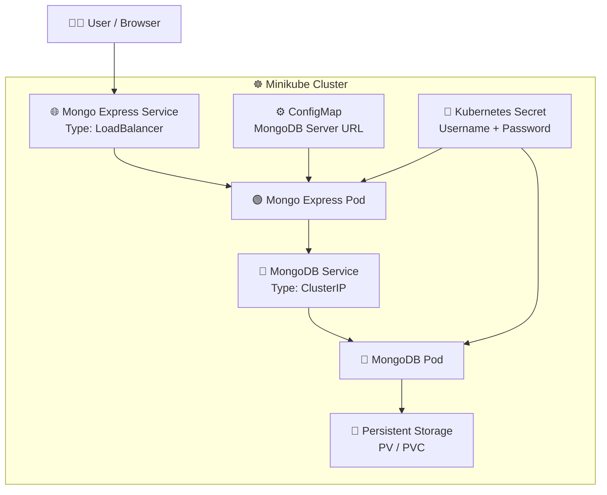
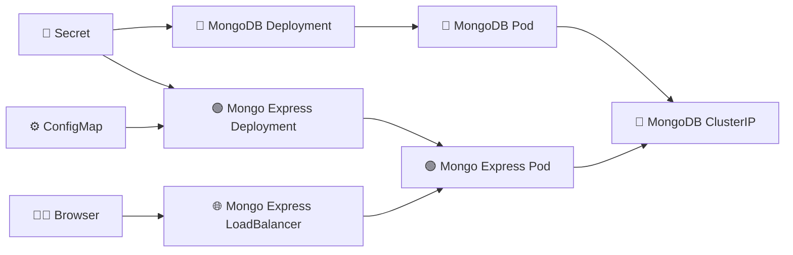

# k8s-mongodb-mongoexpress-stack
🧑‍💻 Beginner-friendly Kubernetes hands-on lab to deploy MongoDB and Mongo Express on Minikube with Secrets, ConfigMaps, Deployments, Services, LoadBalancer, ClusterIP, and persistent storage(optional)
# 🚀 MongoDB + Mongo Express on Minikube


A beginner-friendly Kubernetes hands-on project to deploy **MongoDB** and **Mongo Express** inside a local **Minikube** cluster.

This project demonstrates how Kubernetes resources such as:

* 🔐 Secrets
* ⚙️ ConfigMaps
* 🚀 Deployments
* 🌐 Services
* 💾 Persistent Volumes / Claims
* ☸️ Minikube
* ⚖️ LoadBalancer

work together in a real-world application architecture.

---

## 📌 Project Overview

In this project:

1. MongoDB is deployed inside Minikube.
2. MongoDB credentials are stored using a Kubernetes **Secret**.
3. MongoDB is exposed internally using a **ClusterIP Service**.
4. Mongo Express is deployed as a web-based MongoDB administration interface.
5. Mongo Express receives the MongoDB connection information through a **ConfigMap**.
6. Mongo Express receives database credentials through a **Secret**.
7. Mongo Express is exposed outside the Kubernetes cluster using a **LoadBalancer Service**.
8. Users can access Mongo Express from their browser.

### Application Flow

```text
Browser
   │
   │ HTTP
   ▼
Mongo Express
   │
   │ MongoDB connection
   ▼
MongoDB Service
   │
   ▼
MongoDB Pod
   │
   ▼
Persistent Storage
```

---

# 🏗️ Architecture



---

# 🎯 What You Will Learn

After completing this project, you will understand:

* How to create a Minikube cluster
* How Kubernetes Deployments work
* How Pods are created by Deployments
* How Kubernetes Services provide networking
* Difference between `ClusterIP` and `LoadBalancer`
* How to store sensitive values using Secrets
* How to provide configuration using ConfigMaps
* How one application communicates with another application inside Kubernetes
* How to expose an application outside the cluster
* How to troubleshoot Kubernetes deployments

---

# 🛠️ Prerequisites

Install the following tools before starting:

* Docker
* Minikube
* kubectl

Verify the installations:

```bash
docker --version
minikube version
kubectl version --client
```

---

# 🚀 Step 1 — Start Minikube

Start the Minikube cluster:

```bash
minikube start
```

Check the cluster:

```bash
minikube status
```

Expected result:

```text
host: Running
kubelet: Running
apiserver: Running
kubeconfig: Configured
```

Check the nodes:

```bash
kubectl get nodes
```

---

# 🔐 Step 2 — Create Kubernetes Secret

The MongoDB username and password should not be hardcoded directly into Deployment files.

Create:

```text
k8s/secret.yaml
```

Example:

```yaml
apiVersion: v1
kind: Secret
metadata:
  name: mongodb-secret
type: Opaque
stringData:
  mongo-root-username: admin
  mongo-root-password: admin123
```

Apply the Secret:

```bash
kubectl apply -f k8s/secret.yaml
```

Verify:

```bash
kubectl get secrets
```

> ⚠️ Do not commit real production passwords to GitHub.

For a public repository, use placeholder values or provide a `secret.yaml.example` file and add the real `secret.yaml` to `.gitignore`.

---

# 🍃 Step 3 — Deploy MongoDB

Create:

```text
k8s/mongodb/deployment.yaml
```

Example:

```yaml
apiVersion: apps/v1
kind: Deployment
metadata:
  name: mongodb
spec:
  replicas: 1
  selector:

    matchLabels:
      app: mongodb
  template:
    metadata:
      labels:
        app: mongodb
    spec:
      containers:
        - name: mongodb
          image: mongo:latest
          ports:
            - containerPort: 27017

          env:
            - name: MONGO_INITDB_ROOT_USERNAME
              valueFrom:
                secretKeyRef:
                  name: mongodb-secret
                  key: mongo-root-username

            - name: MONGO_INITDB_ROOT_PASSWORD
              valueFrom:
                secretKeyRef:
                  name: mongodb-secret
                  key: mongo-root-password
```

Apply it:

```bash
kubectl apply -f k8s/mongodb/deployment.yaml
```

Check the Deployment:

```bash
kubectl get deployments
```

Check the Pod:

```bash
kubectl get pods
```

---

# 🌐 Step 4 — Create MongoDB Service

MongoDB does not need to be exposed publicly.

Create:

```text
k8s/mongodb/service.yaml
```

```yaml
apiVersion: v1
kind: Service
metadata:
  name: mongodb-service
spec:
  selector:
    app: mongodb

  type: ClusterIP

  ports:
    - protocol: TCP
      port: 27017
      targetPort: 27017
```

Apply:

```bash
kubectl apply -f k8s/mongodb/service.yaml
```

Verify:

```bash
kubectl get svc
```

The MongoDB Service can now be accessed internally using:

```text
mongodb-service:27017
```

This DNS name is available to other Pods inside the Kubernetes cluster.

---

# ⚙️ Step 5 — Create ConfigMap

Mongo Express needs to know where MongoDB is running.

Create:

```text
k8s/mongo-express/configmap.yaml
```

```yaml
apiVersion: v1
kind: ConfigMap
metadata:
  name: mongo-express-config
data:
  mongo-server: mongodb-service
```

Apply:

```bash
kubectl apply -f k8s/mongo-express/configmap.yaml
```

Verify:

```bash
kubectl get configmap
```

---

# 🟢 Step 6 — Deploy Mongo Express

Create:

```text
k8s/mongo-express/deployment.yaml
```

```yaml
apiVersion: apps/v1
kind: Deployment
metadata:
  name: mongo-express
spec:
  replicas: 1

  selector:
    matchLabels:
      app: mongo-express

  template:
    metadata:
      labels:
        app: mongo-express

    spec:
      containers:
        - name: mongo-express
          image: mongo-express:latest

          ports:
            - containerPort: 8081

          env:
            - name: ME_CONFIG_MONGODB_SERVER
              valueFrom:
                configMapKeyRef:
                  name: mongo-express-config
                  key: mongo-server

            - name: ME_CONFIG_MONGODB_ADMINUSERNAME
              valueFrom:
                secretKeyRef:
                  name: mongodb-secret
                  key: mongo-root-username

            - name: ME_CONFIG_MONGODB_ADMINPASSWORD
              valueFrom:
                secretKeyRef:
                  name: mongodb-secret
                  key: mongo-root-password
```

Apply:

```bash
kubectl apply -f k8s/mongo-express/deployment.yaml
```

Check:

```bash
kubectl get pods
```

---

# 🌍 Step 7 — Expose Mongo Express

Mongo Express needs to be accessible from the browser.

Create:

```text
k8s/mongo-express/service.yaml
```

```yaml
apiVersion: v1
kind: Service
metadata:
  name: mongo-express-service
spec:
  selector:
    app: mongo-express

  type: LoadBalancer

  ports:
    - protocol: TCP
      port: 8081
      targetPort: 8081
```

Apply:

```bash
kubectl apply -f k8s/mongo-express/service.yaml
```

Check:

```bash
kubectl get svc
```

---

# 🌐 Step 8 — Access Mongo Express

Because this project uses Minikube, the easiest way to access the LoadBalancer service is:

```bash
minikube service mongo-express-service
```

Minikube will provide an accessible URL and can open the service in your browser.

Alternatively:

```bash
minikube service mongo-express-service --url
```

---

# 🔍 Step 9 — Verify Everything

Check all resources:

```bash
kubectl get all
```

Check Pods:

```bash
kubectl get pods -o wide
```

Check Services:

```bash
kubectl get svc
```

Check Deployments:

```bash
kubectl get deployments
```

Check Secrets:

```bash
kubectl get secrets
```

Check ConfigMaps:

```bash
kubectl get configmaps
```

---

# 🧪 Step 10 — Test MongoDB Connection

Check the Mongo Express logs:

```bash
kubectl logs deployment/mongo-express
```

Check MongoDB logs:

```bash
kubectl logs deployment/mongodb
```

If Mongo Express successfully connects to MongoDB, the application should become available through the Mongo Express web interface.

---

# 📁 Project Structure

```text
mongodb-mongoexpress-minikube/
│
├── README.md
│
├── .gitignore
│
├── architecture/
│   └── architecture.png
│
├── k8s/
│   │
│   ├── secret.yaml.example
│   │
│   ├── mongodb/
│   │   ├── deployment.yaml
│   │   └── service.yaml
│   │
│   └── mongo-express/
│       ├── configmap.yaml
│       ├── deployment.yaml
│       └── service.yaml
│
└── docs/
    └── troubleshooting.md
```

---

# 🔗 Kubernetes Resource Relationship



---

# 🔐 Security Notes

For learning purposes, this project uses Kubernetes Secrets.

However, Kubernetes Secrets are **not equivalent to a production-grade secret management system**.

For production environments, consider using:

* Azure Key Vault
* HashiCorp Vault
* AWS Secrets Manager
* External Secrets Operator

Never commit real passwords, API keys, tokens, or certificates to GitHub.

---

# 🧹 Cleanup

Delete all resources:

```bash
kubectl delete -f k8s/
```

Stop Minikube:

```bash
minikube stop
```

Delete the Minikube cluster completely:

```bash
minikube delete
```

---

# 🐛 Troubleshooting

## Check Pod status

```bash
kubectl get pods
```

If a Pod is not running:

```bash
kubectl describe pod <pod-name>
```

---

## Check Pod logs

MongoDB:

```bash
kubectl logs deployment/mongodb
```

Mongo Express:

```bash
kubectl logs deployment/mongo-express
```

---

## Check Services

```bash
kubectl get svc
```

---

## Check Service endpoints

```bash
kubectl get endpoints
```

If MongoDB Service has no endpoint, verify that the Service selector matches the MongoDB Pod labels.

---

## Check MongoDB Service DNS

Mongo Express should use:

```text
mongodb-service
```

and not:

```text
localhost
```

Inside Kubernetes, `localhost` refers to the same Pod/container, not another Pod.

---

# 📚 Kubernetes Concepts Used

| Resource     | Purpose                            |
| ------------ | ---------------------------------- |
| Minikube     | Local Kubernetes cluster           |
| Deployment   | Manages application Pods           |
| Pod          | Runs application containers        |
| Secret       | Stores sensitive credentials       |
| ConfigMap    | Stores non-sensitive configuration |
| ClusterIP    | Internal Kubernetes networking     |
| LoadBalancer | Exposes application externally     |
| Service      | Provides stable network access     |
| PV/PVC       | Persistent database storage        |

---

# ⭐ Why MongoDB Uses ClusterIP

MongoDB should normally remain internal to the Kubernetes cluster.

```text
Internet
   ❌
   │
   X
MongoDB
   ▲
   │
Mongo Express
```

Mongo Express communicates with MongoDB internally:

```text
Mongo Express
      │
      │ mongodb-service:27017
      ▼
MongoDB
```

This reduces unnecessary external exposure.

---

# ⭐ Why Mongo Express Uses LoadBalancer

Mongo Express is a web UI that needs to be accessed by the user.

Therefore:

```text
Browser
   │
   ▼
LoadBalancer Service
   │
   ▼
Mongo Express Pod
```

For Minikube:

```bash
minikube service mongo-express-service
```

---

# 🎓 Practice Challenges

Once the basic deployment works, try these exercises:

### Challenge 1

Change Mongo Express replicas from:

```yaml
replicas: 1
```

to:

```yaml
replicas: 2
```

Then check:

```bash
kubectl get pods
```

### Challenge 2

Change the MongoDB image version.

### Challenge 3

Add MongoDB persistent storage using PV and PVC.

### Challenge 4

Create a separate Kubernetes namespace:

```text
mongodb-demo
```

and deploy the entire application inside it.

### Challenge 5

Try accessing MongoDB from another temporary Pod.

### Challenge 6

Delete the MongoDB Pod and observe what happens.

```bash
kubectl delete pod <mongodb-pod-name>
```

Then:

```bash
kubectl get pods
```

Observe how the Deployment recreates the Pod.

---

# 🏆 Expected Final Architecture

```text
                         👨‍💻 USER
                           │
                           │ HTTP
                           ▼
                ┌──────────────────────┐
                │ 🌐 LoadBalancer      │
                │ Mongo Express :8081  │
                └──────────┬───────────┘
                           │
                           ▼
                ┌──────────────────────┐
                │ 🟢 Mongo Express     │
                │       Pod            │
                └──────────┬───────────┘
                           │
                    mongodb-service
                           │
                           ▼
                ┌──────────────────────┐
                │ 🔵 MongoDB Service   │
                │      ClusterIP       │
                └──────────┬───────────┘
                           │
                           ▼
                ┌──────────────────────┐
                │ 🍃 MongoDB Pod       │
                └──────────┬───────────┘
                           │
                           ▼
                    💾 PV / PVC


       🔐 Secret ───────────────► MongoDB
           │
           └────────────────────► Mongo Express

       ⚙️ ConfigMap ────────────► Mongo Express
```

---

# ❤️ If This Project Helped You

If you found this Kubernetes hands-on project useful, consider giving the repository a ⭐ on GitHub.

This project is intended for **learning, practice, and Kubernetes hands-on experience**.

Happy Learning! 🚀☸️
